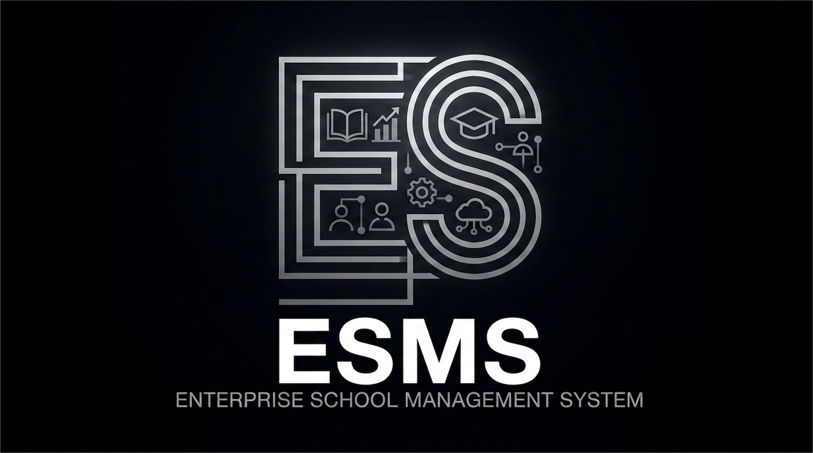

<p align="center">
  
</p>

<p align="center">
  <strong>Scalable • Modular • Secure • Localized</strong><br>
  <em>The Definitive Digital Infrastructure for Modern Higher Education in Uganda.</em>
</p>

---

##  Project Vision
The **Enterprise School Management System (ESMS)** is a high-performance, layered digital ecosystem engineered to automate the complex workflows of university administration. Built with a focus on **Editorial Minimalism** and **System Integrity**, ESMS bridges the gap between academic excellence and administrative efficiency.

Designed specifically for the Ugandan educational landscape, it ensures full compliance with **National Council for Higher Education (NCHE)** guidelines while providing a cinematic, user-centric experience.

---

##  System Architecture
ESMS follows a strictly decoupled, layered architecture to ensure horizontal scalability and maintainability:

1.  **Frontend Layer:** A responsive, glassmorphic UI built with **Next.js 14 (App Router)** and **Tailwind CSS**, following an "Editorial Minimalism" design philosophy.
2.  **Service Layer:** A modular service layer managing Academics, Finance, Admissions, and Staff workflows.
3.  **Integrations Layer:** Seamless connectivity with local payment gateways (MTN MoMo, Airtel Money) and banking APIs (Stanbic/Centenary).
4.  **Database Layer:** A 3NF-compliant relational core (**PostgreSQL**) powered by **Supabase**, ensuring data integrity and real-time synchronization.

---

##  Role-Based Access Control (RBAC)
Security is at the heart of ESMS. We implement **Row-Level Security (RLS)** via Supabase to ensure data isolation:

- **Students:** Access to grades, timetables, and fee statements.
- **Lecturers:** Result entry, attendance tracking, and curriculum management.
- **Finance Officers:** UGX reconciliation, scholarship management, and invoicing.
- **Registrars:** Admissions oversight, transcript generation, and enrollment.
- **SuperAdmins:** System configuration, audit log monitoring, and RBAC management.

---

##  Key Features

###  Academic Excellence
- Automated GPA/CGPA calculations.
- Intelligent course registration and curriculum tracking.
- Digital transcript generation with cryptographic verification.

###  Financial Transparency (UGX Optimized)
- Real-time fee balance tracking.
- Integration with major Ugandan Mobile Money and Banking systems.
- Automated bursary and scholarship allocation logic.

###  Administrative Intelligence
- Biometric-ready attendance tracking.
- Centralized staff workload and payroll management.
- Comprehensive audit trails for NCHE compliance.

---

##  Technical Stack
- **Languages:** TypeScript, SQL (PL/pgSQL), JavaScript (ES6+)
- **Frameworks:** Next.js 14+ (App Router), Tailwind CSS
- **Database:** PostgreSQL (Supabase)
- **Auth:** Supabase Auth (JWT + Multi-Factor Authentication)
- **Deployment:** Vercel, Docker

---

##  Installation & Setup
```bash
# Clone the repository
git clone https://github.com/EGABO-TECH/ESMS.git

# Install dependencies
npm install

# Setup Environment Variables (.env.local)
# NEXT_PUBLIC_SUPABASE_URL=your_supabase_url
# NEXT_PUBLIC_SUPABASE_ANON_KEY=your_key

# Run development server
npm run dev
```

---
<p align="center">
  <em>© 2026 THE RULE OF 10. Built with precision for the future of education.</em>
</p>


